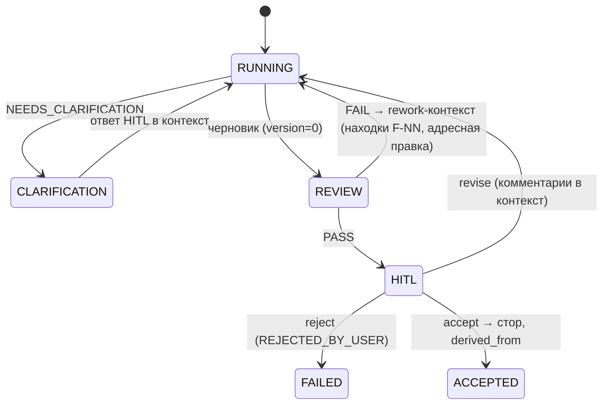

# Архитектура Agent Workshop (фактическая)

Актуальность: 13.07.2026, по коду `workshop/` и конфигам `configs/`.
Назначение документа: техническое устройство продукта как он реализован.
Концепция и обоснования решений — в `document-desing.md`, требования и их
статус — в `task_statement.md`.

## 1. Обзор

Продукт — **фабрика LLM-агентов**: детерминированный FSM-оркестратор прогоняет
входной материал через конфигурируемый граф LLM-узлов («мастерских»). Каждый
узел за запуск производит ровно один **артефакт** (или уточняющий вопрос
`NEEDS_CLARIFICATION`). Артефакты версионируются в файловом сторе, связаны
`derived_from` и проходят гейты: агентское ревью (находки с весами p0–p3 →
PASS/FAIL) и HITL (accept / revise / reject). Конкретный **цех** задаётся
только конфигом `configs/<shop>/` — ядро `workshop/` на цех не меняется.

## 2. Слои репозитория

| Каталог | Роль |
|---|---|
| `workshop/` | Ядро фабрики (весь исполняемый код) |
| `configs/<shop>/` | Цеха: граф, узлы, промпты, профили моделей |
| `wiki/` | База знаний (Markdown + Mermaid), поддерживается цехом `wiki_maintainer` |
| `wiki_html/` | Детерминированная HTML-витрина wiki (`wiki-render`) |
| `projects/<project>/` | Выходы прогонов: стор артефактов, журналы, пакеты, подмодули |
| `text_searcher/` | Рукописный seed: эталонная цепочка артефактов GRACE (вход-пример, не выход прогона) |
| `prompts/` | Общие промпты ревью артефактов |
| `user_docs/` | Документация + живые материалы: `user_docs/prompts/*.md` — base-промпты, на которые ссылаются node-конфиги |
| `tests/` | pytest: 29 файлов, ~297 тестов, включая e2e по цехам |

## 3. Модули ядра `workshop/`

| Модуль | M-код | Назначение |
|---|---|---|
| `orchestrator.py` | M-09 | FSM переходов, гейты, итерационные циклы, топологический обход, resume |
| `workshop_node.py` | M-06 | Один запуск узла: сборка промпта, tool-цикл, парсинг вывода |
| `config_loader.py` | M-01 | Загрузка/валидация конфигов узлов, графа, реестра моделей, спек продуктов |
| `artifact_store.py` | M-02 | Версионированный файловый стор артефактов, `derived_from`, кросс-ссылки |
| `prompt_builder.py` | M-03 | Сборка промпта: base + stage-карта (`@fragment`) + `{{INPUTS}}` |
| `llm_client.py` / `openai_llm.py` | M-04 | Абстракция LLM-провайдера + адаптер OpenAI-совместимого API (единственный) |
| `run_log.py` | M-05 | Append-only JSONL-журнал прогонов узлов |
| `review_gate.py` | M-07 | Агентское ревью: парсинг находок (вес, правило, локация), гейт PASS/FAIL, judge-вердикт READY/NOT_READY |
| `hitl_cli.py` | M-08 | HITL-приёмка в терминале; протокол `HITL` (Accept/Revise/Reject) |
| `sandbox.py` | M-10 | Изолированный запуск кода/тестов в Docker с лимитами |
| `codegen_loop.py` | M-11 | Кодогенерация: file map ` ```file:путь ` → тесты в песочнице → доработка |
| `packager.py` | M-12 | Детерминированная сборка пакета проекта (код + git + frozen deps + README), без LLM |
| `acceptance.py` | M-13 | Механическая сверка sha256 файлов цеха с приёмочными таблицами CHANGELOG |
| `assembler.py` | M-14 | Сборка продукта из сервисов-пакетов через docker-compose, без LLM |
| `decomposer.py` | M-15 | Разрез принятого `domains.xml` на подмодули-проекты, без LLM |
| `wiki_loader.py` | M-16 | Страницы wiki, бандлы для узлов, проверка ссылок, линт `{{` |
| `wiki_renderer.py` | M-17 | Статическая HTML-витрина wiki (Mermaid на клиенте) |
| `wiki_applier.py` | M-18 | Применение file map к wiki: валидация путей, wiki-check на копии, атомарная запись |
| `factory_cli.py` | M-19 | Реестр цехов (`discover_shops`), статус проектов, интерактивное меню |
| `mcp_server.py` | M-20 | MCP-сервер (stdio): асинхронные прогоны, дистанционный HITL через очереди |
| `web_search.py` | M-21 | Веб-поиск как инструмент узла (провайдер MVP — Tavily) |
| `material.py` | M-22 | Материал как чанк-стор: инжест, TOC, ретривер (лексический MVP, опц. векторный BGE-M3); инструменты `material_search/get`, `wiki_search/get` |
| `map_driver.py` | M-23 | Массовый прогон цеха по элементам (glob-файлы / таблицы schema.yaml), под-стор на элемент, до 16 воркеров |
| `db_query.py` | M-24 | Read-only SELECT к БД как инструмент узла (MVP — psycopg; DSN из `WORKSHOP_DB_DSN`) |
| `models.py` | — | Pydantic-модели конфигов, dataclass-модели артефактов |
| `result.py` | — | `Ok`/`Err` — явные возвраты вместо исключений в бизнес-логике |
| `__main__.py` | — | CLI-вход и диспетчеризация подкоманд |

## 4. Жизненный цикл узла (FSM)

Состояния: `PENDING → RUNNING → REVIEW → HITL → ACCEPTED`, плюс
`CLARIFICATION` и `FAILED`. Таблица переходов явная; недопустимый переход —
RuntimeError (баг), не бизнес-ошибка.



- Потолок итераций rework-цикла — `max_iterations` (по умолчанию 3),
  превышение → `MAX_ITERATIONS_EXCEEDED`.
- Узлы `kind=codegen` идут отдельной веткой: file map → тесты в Docker →
  judge-гейт (автоцикл judge→codegen внутри узла) → HITL. Review-гейт для
  codegen запрещён — оценка кода принадлежит judge.
- Upstream: 0 предшественников → сырой input; 1 → его артефакт; несколько →
  конкатенация контентов (MVP-ограничение).
- **Autopilot** — отдельный `graph.autopilot.json` со снятым HITL (agent-review
  остаётся); режим smoke-прогонов. `--resume` пропускает принятые узлы.

## 5. Анатомия цеха `configs/<shop>/`

- `graph.json` — обязателен; по нему цех обнаруживается реестром.
  Опционально `graph.autopilot.json` и иные варианты (`graph.fix.json`).
- `nodes/*.json` — на узел: `base_prompt_path`, `stage_map_path`, `wiki_refs`
  (с пиннингом версий) или `wiki_refs_from` (динамически из артефакта
  `tech_selection`), `tools`, профиль модели; отдельные `*_review.json` /
  `judge.json` для гейтов.
- `prompts/*.md` — base-промпты и stage-карты (`@fragment NAME ... @end`).
- `models.json` — профили LLM; поддержана политика по `task_class`
  (в текущих конфигах не задействована — узлы задают `llm_profile` напрямую).
- Опционально: `CHANGELOG.md` (приёмка FR-17), `sandbox.Dockerfile`, `demo/`.

## 6. Реестр цехов

| Цех | Стадии | Назначение |
|---|---|---|
| `microservice` | domains → contracts → openapi + tech_selection + c4 → executor | Микросервис из требований по GRACE (STRICT → PROJECTION → код+тесты), все узлы с HITL |
| `data_analyst` | task_spec → tech_selection → executor | Анализ данных: ТЗ → стек → кодогенерация с judge-гейтом |
| `llm_wiki` | wiki_spec → wiki_pages | Вики из выгрузок чатов/документов (через material-чанкование) |
| `wiki_maintainer` | wiki_spec → wiki_pages | Поддержка проектной wiki; вызывается MCP `wiki_update` с авто-apply |
| `prompt_roaster` | roast (вариант: roast → roast_fix) | «Прожарка» промптов; map-прогон, без HITL |
| `table_validator` | table_check | Валидация таблиц schema.yaml; map-прогон, без HITL |
| `products/` | — | Не цех: спеки продуктов для `assemble` |

## 7. Точки входа

**CLI** (`python -m workshop <cmd>`; без аргументов — интерактивное меню):
`run`, `map`, `shops`, `status`, `extract`, `package`, `assemble`,
`decompose`, `verify-acceptance`, `wiki-check`, `wiki-render`, `wiki-apply`,
`mcp-serve`. Полная справка — `wiki/methodology/workshop-cli.md`.

**MCP-сервер** (stdio; `claude mcp add agent-workshop -- <venv>/python -m
workshop mcp-serve`), 12 инструментов: `list_shops`, `run_shop`, `run_status`,
`get_pending_interaction`, `submit_decision`, `list_artifacts`,
`get_artifact`, `get_project_status`, `verify_acceptance_tool`, `wiki_update`,
`wiki_read`, `wiki_check`. Дистанционный HITL — асинхронная пара
`get_pending_interaction`/`submit_decision`; не более одного живого прогона
на проект; секреты (.env) не покидают процесс сервера.

## 8. Известные MVP-ограничения

- Один LLM-провайдер (OpenAI-совместимый адаптер); `llm_client` — seam под
  мультипровайдерность.
- `db_query` — только psycopg/Postgres; `web_search` — только Tavily.
- Ретривер материала — лексический (векторный BGE-M3 — опциональный seam).
- Несколько upstream-артефактов объединяются конкатенацией.
- Политика выбора модели по `task_class` реализована, но конфигами не
  задействована.
